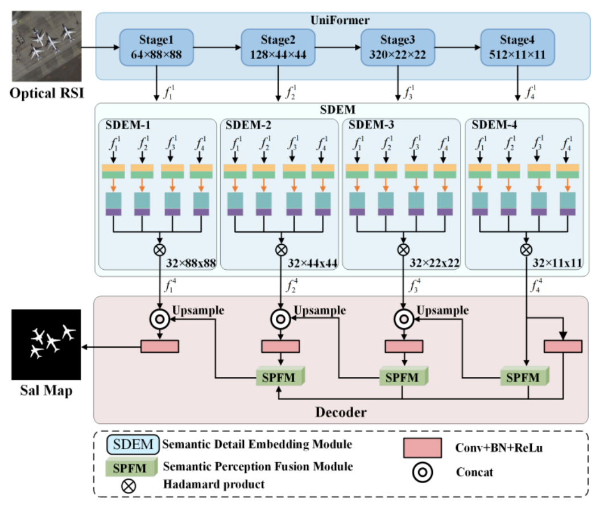
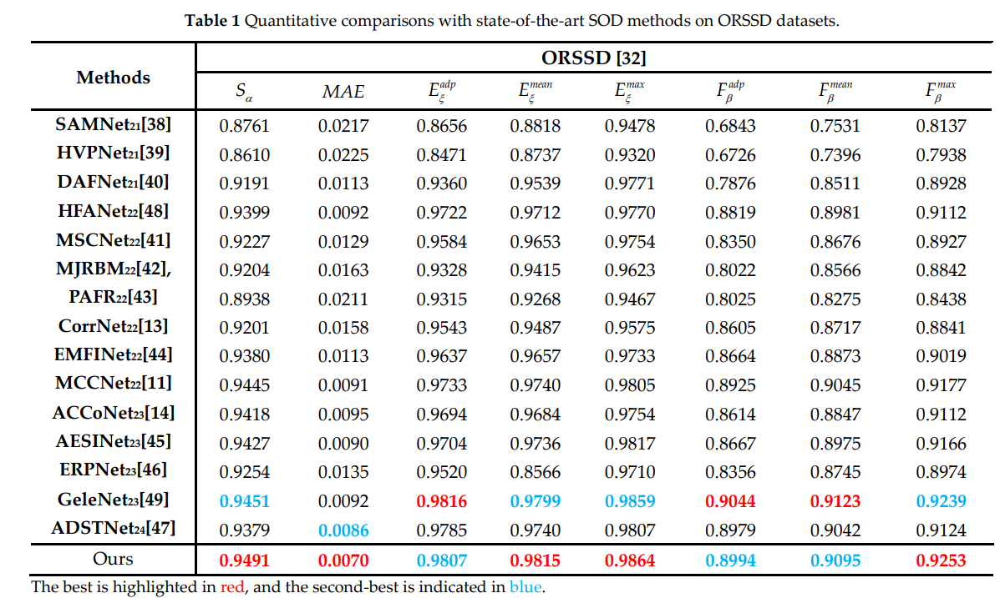
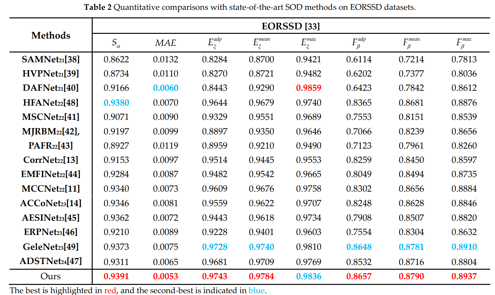
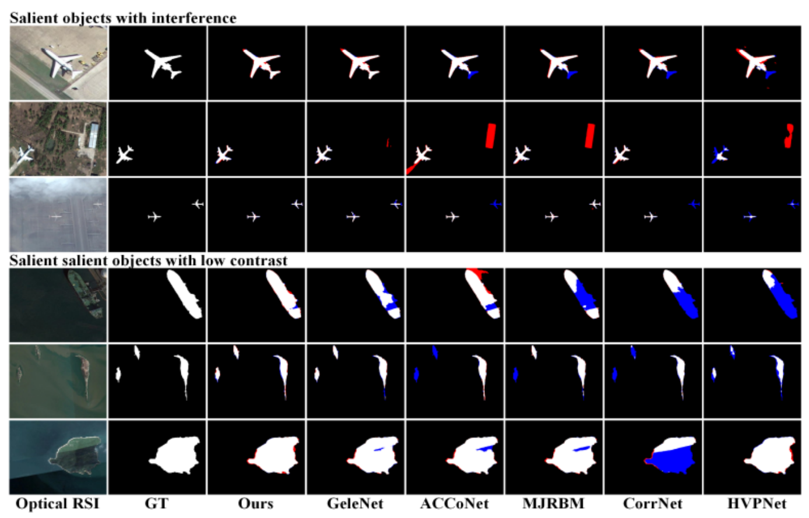

# GSANet
This project provides the code and results for 'Global Semantic-Sense Aggregation Network for Salient Object Detection in Remote Sensing Images'
<p align="center"> </p>

# Saliency maps
   We provide saliency maps of our GSANet and all compared methods at [GSANet_SalMap and ComparisonMethods](https://pan.baidu.com/s/1Xp8TSt1UBiaKwQrGjgJtDg?pwd=o4dz) (code:o4dz) on two datasets (ORSSD and EORSSD).
    
# DateSets
ORSSD download  https://github.com/rmcong/ORSSD-dataset

EORSSD download https://github.com/rmcong/EORSSD-dataset
```python
GSANet
├── EORSSD
│   ├── train
│   │   ├── images
│   │   │   ├── 0001.jpg
│   │   │   ├── 0002.jpg
│   │   │   ├── .....
│   │   ├── lables
│   │   │   ├── 0001.png
│   │   │   ├── 0002.png
│   │   │   ├── .....
│   │   
│   ├── test
│   │   ├── images
│   │   │   ├── 0004.jpg
│   │   │   ├── 0005.jpg
│   │   │   ├── .....
│   │   ├── lables
│   │   │   ├── 0004.png
│   │   │   ├── 0005.png
│   │   │   ├── .....
```
# Training
   We use data_aug.m for data augmentation.

   Download [uniformer_base_ls_in1k.pth](https://pan.baidu.com/s/1Xp8TSt1UBiaKwQrGjgJtDg?pwd=o4dz) (code: o4dz), and put it in './pretrain/'. 

   Modify paths of datasets, then run train_MyNet.py.


# testing
1. Download the pre-trained models (MyNet_EORSSD.pth and MyNet_ORSSD.pth) on [GSAMet_Pretrain](https://pan.baidu.com/s/1Xp8TSt1UBiaKwQrGjgJtDg?pwd=o4dz) (code:o4dz)
2. Modify paths of pre-trained models  and datasets (EORSSD and ORSSD).
3. Run test_MyNet.py.

# Results
ORSSD Dataset Result
<p align="center"> </p>
EORSSD Dataset Result
<p align="center"> </p>

# Visualization of results
<p align="center"> </p>

# Evaluation Tool
   You can use the [evaluation tool (MATLAB version)](https://github.com/MathLee/MatlabEvaluationTools) to evaluate the above saliency maps.


# [ORSI-SOD_Summary](https://github.com/MathLee/ORSI-SOD_Summary)
   
# Contact
If you have any questions, please submit an issue on GitHub or contact me by email (cxh1638843923@gmail.com).
       
                
                

